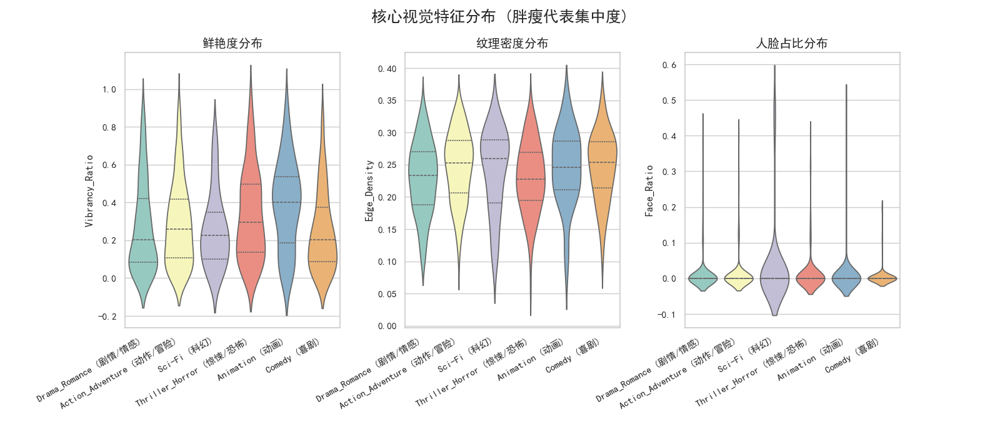
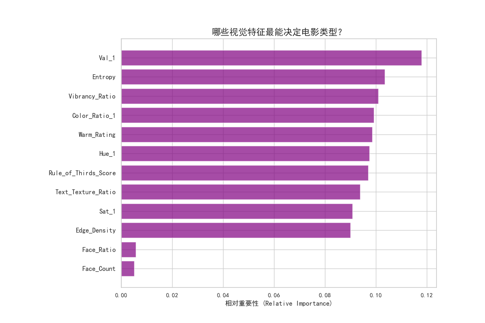
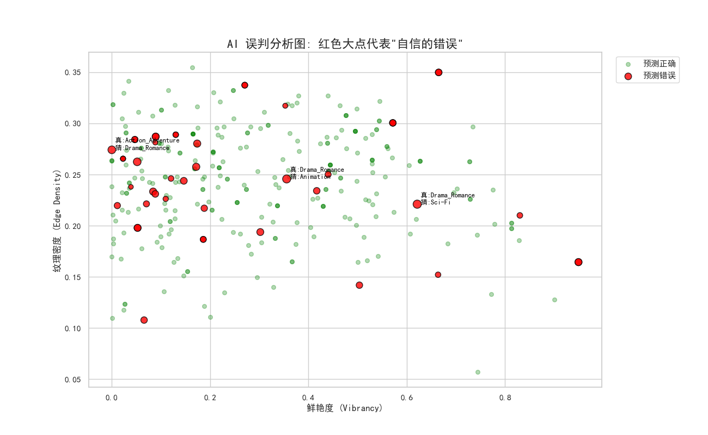
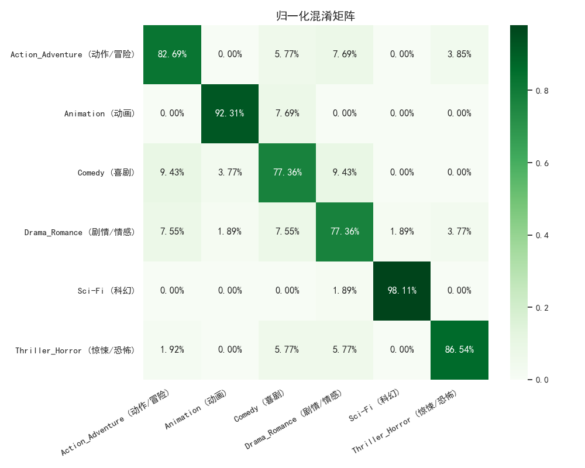
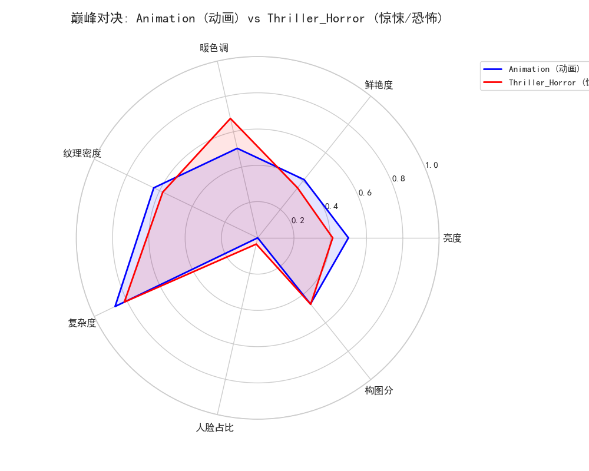
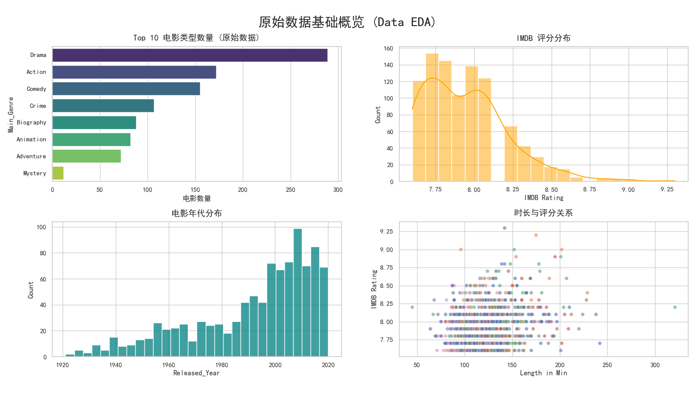
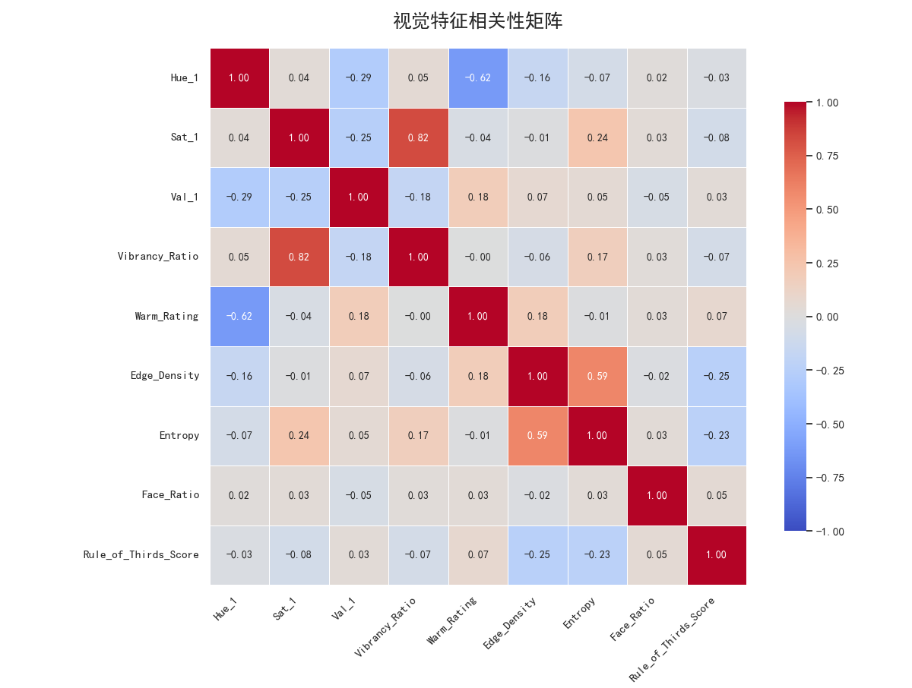
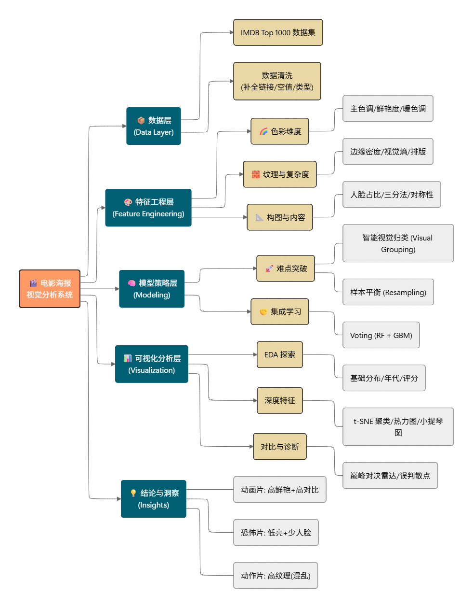

# 电影海报视觉全维度分析系统

> 基于 IMDB Top 1000 电影海报的多维视觉特征提取与机器学习分类系统，自动识别电影视觉流派。

## 功能亮点

- **20+ 维视觉特征提取** — 颜色（KMeans 主色调 HSV）、纹理（边缘密度、视觉熵）、构图（三分法评分）、人脸检测，全方位量化海报视觉语言
- **机器学习分类** — RandomForest + GradientBoosting 投票集成器，将海报自动归类为动画/惊悚/科幻/动作/喜剧/剧情六大视觉流派
- **丰富的可视化分析** — t-SNE 聚类地图、雷达对比图、特征相关性热力图、小提琴分布图、混淆矩阵、误判散点图等 7+ 种图表

## 项目结构

```
movie-analyse/
├── main.py                  # 主入口：串联数据加载→特征提取→ML分类→可视化全流程
├── requirements.txt         # Python 依赖
├── .gitignore
├── README.md
├── data/
│   └── imdb_top_1000.csv    # IMDB Top 1000 数据集
├── src/
│   ├── __init__.py
│   ├── data_loader.py       # 数据加载与清洗（列名映射、缺失值处理、类型拆分）
│   ├── poster_analyzer.py   # 海报下载 + 20+ 维视觉特征提取（颜色/纹理/构图/人脸）
│   ├── ml_models.py         # ML 分类器（RF + GB 投票集成、混淆矩阵）
│   ├── stats_analyzer.py    # 统计检验（T-test 显著性分析）
│   └── visualizer.py        # 可视化（热力图/小提琴图/t-SNE/雷达图/散点图）
├── test/
│   ├── test_data.py         # 数据加载模块测试
│   ├── test_analyze.py      # 海报分析模块测试（Mock 模拟）
│   └── test_network.py      # 网络代理连通性测试
└── photo/                   # 示例输出图表
    ├── Figure_1.png
    ├── Figure_2.png
    ├── ...
    └── 思维导图.png
```

## 安装

```bash
# 克隆项目
git clone <repo-url>
cd movie-analyse

# 创建虚拟环境（推荐）
python -m venv venv
source venv/bin/activate  # Linux/Mac
# venv\Scripts\activate   # Windows

# 安装依赖
pip install -r requirements.txt
```

## 使用方法

### 1. 准备数据

将 `imdb_top_1000.csv` 放入 `data/` 目录。CSV 需包含以下列：

| 列名 | 说明 |
|------|------|
| `Poster_Link` | 海报图片 URL |
| `Series_Title` | 电影名称 |
| `Genre` | 电影类型 |
| `IMDB_Rating` | IMDB 评分 |
| `Runtime` | 时长 |

### 2. 运行分析

```bash
python main.py
```

程序将依次执行：
1. 加载并清洗 IMDB 数据集
2. 下载海报并提取 20+ 维视觉特征
3. 训练 ML 分类器，识别视觉流派
4. 生成全部可视化图表

### 3. 运行测试

```bash
python -m pytest test/ -v
```

## 示例输出

| 图表 | 说明 |
|------|------|
|  | 原始数据基础概览（类型分布、评分分布、年代分布、时长-评分关系） |
|  | 归一化混淆矩阵 |
|  | 视觉特征相关性矩阵 |
|  | 核心视觉特征分布（鲜艳度/纹理密度/人脸占比） |
|  | t-SNE 聚类地图 |
|  | 动画 vs 惊悚/恐怖 雷达对比图 |
|  | 特征重要性排行 |
|  | 系统架构思维导图 |

## 技术架构

```
CSV 数据 → 数据清洗 (pandas)
         → 海报下载 (requests + ThreadPoolExecutor)
         → 视觉特征提取 (OpenCV + Pillow + KMeans)
             ├── 颜色：Top3 主色调 HSV、鲜艳度、暖色调指数
             ├── 纹理：边缘密度、视觉熵、文字纹理比
             ├── 构图：三分法评分
             └── 人脸：Haar 级联检测（数量+占比）
         → ML 分类 (RandomForest + GradientBoosting 投票)
         → 可视化 (matplotlib + seaborn + t-SNE)
```

## 技术栈

- Python 3.12
- pandas, numpy, scikit-learn
- OpenCV (cv2), Pillow
- matplotlib, seaborn
- tqdm, requests, scipy

## 许可证

本项目仅供学习和研究使用。IMDB 数据版权归 IMDB 所有。
